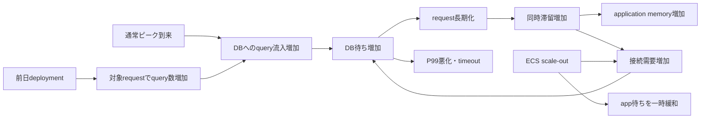

# Scenario #001：復旧結果と判断過程を分けて検証する

この試作は、不完全な情報から観測と介入を選ぶループの成立を検証する。採点は判断記録の代理指標であり、熟練度を測定できると確認した尺度ではない。対象は中級バックエンドエンジニア、実時間20〜30分（説明3分・プレイ12〜17分・振り返り5〜10分）を仮置きする。シミュレーション内の時間とは区別する。

## 1. Hidden state：前日の変更が、今日の負荷で顕在化する

checkoutの一部（大きなカート）でrecommendation処理が商品ごとのSELECTを発行する。平時3回のDBアクセスが対象リクエストでは27回になる。前日デプロイ直後は低トラフィックで顕在化せず、今日の通常ピークでDB待ちが増えた。課金や注文データの破壊はない。初期4 tasks、1 taskあたり接続プール上限100、DB接続上限500。DB全体のQPSは他APIと再試行を含み、平時650、障害時950、接続逼迫時1100と設定する。対象requestの27回と流入だけの積には一致しない。リトライと滞留リクエストがあり、流入が一定でも処理待ちを追加taskが引き受けるとDBへの到達量が増える。

世界の状態は、経過分、変更の有効性、task数、scale完了時刻、DB容量、pool制限、回復経過、連続健全分、累積失敗checkout、追加リソース費、機能停止分で管理する。数値は教育用の決定論的な段階モデルであり、AWSの性能予測モデルではない。LLM、外部API、実DBは使わない。

## 2. Causal graph：CPU使用率だけでは待ち時間を説明できない

接続数増加だけでquery数が自動的に増えるとはしない。滞留・再試行・taskごとのpoolという条件を置く。memoryは滞留の結果、DB CPU 61%でも接続待ちが律速になる。

## 3. Observable information：取得時刻と証拠の限界を残す

初期にP50 220ms、P99 3.1s、error 1.8%、ECS CPU 46%、memory 82%、DB CPU 61%、connections 78%、前日deploymentの事実を示す。以後、主要メトリクスは行動後に更新する。深い観測は取得時点のスナップショットとして残す。過去の証拠を最新値で上書きしない。

| 観測 | 得られるもの | 限界 |
|---|---|---|
| App metrics | P50/P95/P99、CPU、memory、OOMなし | 平均CPUだけでは局所的飽和を排除できない |
| DB metrics | connections、query待ち、CPU、QPS | 原因となるコードは特定できない |
| Query analysis | 対象request 27回、平時3回、個別SQLは短い | N+1を強く示すがfeatureとの対応は未確定 |
| Trace | recommendation spanに反復SELECT、待ちの集中 | 対象カートの1サンプル |
| Changes / developer | 前日追加したrecommendation、flagあり、schema変更なし | 時系列の一致だけでは因果の証明にならない |
| SRE | taskごとのpool上限とDB上限、OOMなし | 対処法を指示しない |
| PdM | checkout失敗と離脱リスク、recommendation一時停止を許容 | 売上損失の確定額は算出しない |

slow queryログだけでN+1を断定する罠を避け、query fingerprintの頻度とrequest単位の回数を調べる行動にまとめる。application/error logsはApp/DB metricsに統合する。

## 4–6. Actions：時間・副作用を実行前に示す

行動は直列に完了する。各分で旧状態の顧客影響を積算し、最後に介入を適用する。観測は終了時の値を取得する。介入後に自動的に待つことはなく、再観測や待機で時間を進める。

| Action | 分 | 費用・副作用・実装範囲 |
|---|---:|---|
| App / DB metrics | 各1 | 状態変更なし |
| Query analysis / Trace | 各2 | 状態変更なし |
| Changes / developer | 1 | 状態変更なし |
| SRE / PdM | 各1 | 状態変更なし |
| ECS scale-out 4→8 | 2 | app費用増、接続需要増。8以上にはしない |
| ECSを4へ戻す | 2 | 増設分を除去。原因が残れば元の劣化へ |
| Recommendation disable | 1 | featureを停止。flagがあることの事前確認を推奨 |
| Rollback | 4 | feature停止、schema変更なし。調査せず選択することも可能 |
| DB scale-up | 6 | 追加費用、完了直前1分の接続切替影響。query増加は残る |
| Poolを50/taskに制限 | 2 | DB接続を保護するがapp待ちを増やす |
| 2分観察 | 2 | 新たな介入なし。時間だけ進む |

CPU/memory増強、index、cache、query修正は初版では除外する。観測との対応が弱い選択肢の水増しを避け、修正と検証の開発工程はAARの恒久対策へ送る。

## 7–8. Transitions：一時改善を復旧と取り違えない

未介入では3分ごとにP99 +0.1s、connections +1ポイント（上限90%）。scale-out完了直後から3分未満はP99 1.8s、connections 86%。3分経過後は4.5s、97%。pool制限時はP99 2.7s、connections 70%。DB増強後は1.3s、60%。DB増強とpool制限の併用はapp待ちが残り1.6s。いずれも原因は残る。

rollback/disable完了直後は残存リクエストでP99 1.2s、connections 55%。2分後に0.42s、32%へ回復。健全条件はP99 <0.8sかつerror <0.5%かつconnections <80%。健全化した時点から連続3分を満たして初めて「安定」を表示する。task数を増やしたままでも回復するが費用は残る。

memory低下、一時的P99改善、個別SQLの短さ、平均CPUの余裕を誤読しうる信号とする。介入を選ぶ前に、仮説、目的（情報収集・軽減・原因対応）、期待するP99変化、根拠、確認/中止条件を記録できる。記録を省略して実行しても進行できる。

## 9. Evidence model：未来の証拠を採点に混ぜない

各decisionに開始・終了時刻、開始時メトリクス、取得済みevidence ID、本人が引用したID、仮説、目的、予測、確認条件、自由記述、結果を保存する。選択可能な証拠は既取得分だけ。初期情報を引用可能にするので、recent deploymentと顧客影響を根拠にした早期rollbackも合理的な候補になる。

根拠の関連性はaction別の許容タグで判定し、10分より古い証拠は機械評価から除く。自由記述の意味や本人の誠実さは自動判定しない。仮説を変更した事実と予測結果はAARに出すが、変更しただけでは加点しない。証拠クリック数は加点しない。

## 10. Rubric：5軸を別々に読む

各軸0〜10。全体点と順位は出さない。以下は暫定ルールで、熟練度の測定妥当性は未検証。理由を選択して点を稼げる限界があり、自由記述の妥当性とmental model更新は観察者が評価する。

| 軸 | 初版の計算と意味 |
|---|---|
| Diagnostic Reasoning | 介入ごとに仮説あり2、予測あり2、関連証拠あり4、確認条件あり2を加点し平均。介入なしは0 |
| Evidence Quality | 関連証拠を引用した介入の比率×10。証拠の量は評価しない |
| Mitigation / Customer Impact | 10 − 累積失敗checkout / 80、0〜10に丸める。未安定なら上限5 |
| Change Safety | 介入ごとに確認条件あり4、復旧操作の互換性/feature証拠あり3（その他は3）、次の介入前に結果の観測あり3を平均 |
| Resource / Cost Efficiency | 10 − 追加費用単位/20、0〜10に丸める。介入なしは未評価、未安定なら上限5 |

追加費用は金額でなく相対単位/分（8 tasksで+4、DB増強で+6）。顧客影響は流入600 checkout/分×error率を毎分積算した失敗試行数。ユニーク顧客数・失注・revenueとは呼ばない。遅い成功requestや再試行重複を含む商業的損失は未モデル化と明記する。

## 11. Terminal conditions：安定後にも判断を残す

30分で時間切れ、途中の明示終了は未完了としてAARへ。安定後はプレイヤーが復旧を宣言して終了する（追加リソースを戻してもよい）。安定しただけでは自動終了しない。timeoutは最優先で、行動中に上限へ達した場合は未完了行動の効果を適用しない。途中終了でもログをexportできる。終了後の行動は禁止する。

## 12. Representative paths：順序の一致を正解としない

- Expert候補：DB→changes→disable→DB→2分観察→2分観察→復旧宣言。DB待ちと変更を関連づけ、feature停止の範囲を確認する。Trace→changes→rollbackも妥当な代替。
- 一見合理的な悪化：PdM→scale-out→DB→2分観察。直後1.8s、3分後4.5sを観測。SRE/trace→disableで立て直す。顧客影響を理由にした短期軽減の判断は、最終結果と分けて扱う。
- 偶然成功：記録も引用もなく即rollback→観察→復旧宣言。結果はよいが記録されたreasoningは低い。「考えていなかった」と断定しない。初期証拠を引用し仮説・確認条件を記録した早期rollbackは同じ扱いにしない。
- 過剰調査：App→DB→query→trace→changes→SRE→PdMを繰り返し30分。情報が揃っても介入しなければ失敗試行が増える。Evidenceだけで総合成功としない。
- 費用を使った軽減：DB増強→DB→changes→disable→観察。容量増強は根治ではなく、時間と費用の取引になる。

## 13. AAR：当時の見通しと結果を照合する

5軸、復旧状況、失敗試行、費用、feature停止分、時系列を示す。各判断に当時の証拠と予測、結果、条件付きフィードバックを付ける。scale-outでは「CPUの余裕は初期情報にある。一方で短期の顧客影響軽減という目的は検討できる。3分後のDB接続圧力を再評価したか」を確認する。原因は終了後に開示する。

最後に「どの観測で仮説を維持/変更したか」「次の未知障害で最初に確かめることは何か」の回答を記録し、JSONに含める。自動採点はしない。

## 技術的な根拠とモデルの境界

アプリ増設に伴うpool総接続数の増加は[AWSの接続多重化の解説](https://aws.amazon.com/blogs/database/amazon-rds-proxy-multiplexing-support-for-postgresql-extended-query-protocol/)を参照した。今回の数値や3分の遅延は実測ではなくシナリオの設定値である。

原因究明と影響軽減を分ける方針は[Google SREのIncident Response](https://sre.google/workbook/incident-response/)を参照した。軽減優先が妥当になりうるため、原因を特定してから介入した順序に固定加点しない。
